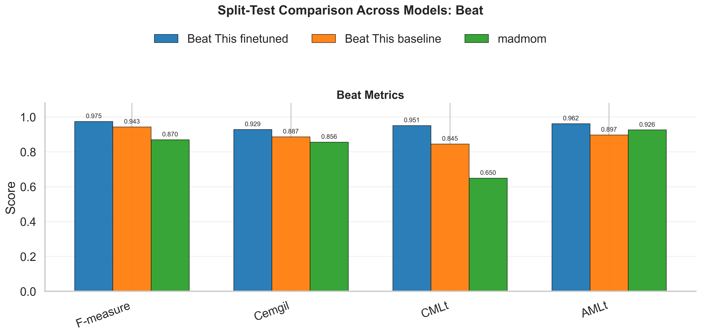
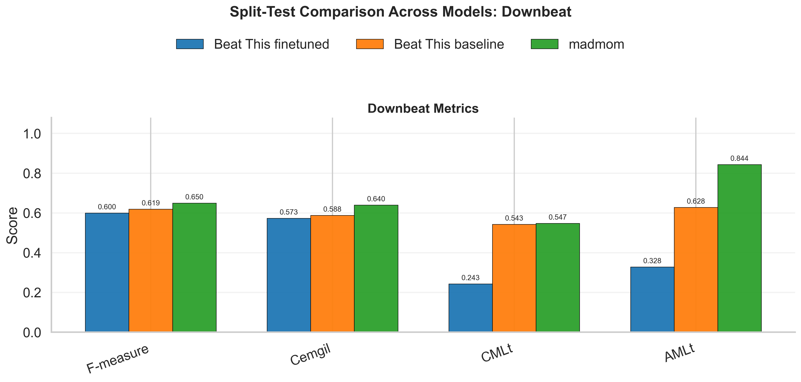
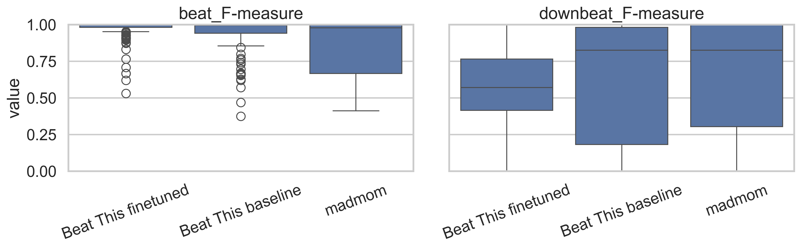

# Learning the Groove: Beat Tracking on the Jazz Trio Dataset

This repository evaluates automatic beat and downbeat tracking on jazz trio recordings, with a focus on finetuning **Beat This!** to the [Jazz Trio Database](https://zenodo.org/records/13828030).

The current state of the project is:

- A full local copy of `jazz-trio-database-v02` is present with 1,294 annotated performances.
- Baseline **Beat This!**, fine-tuned **Beat This!**, and **madmom** evaluations have been run.
- A strict 70/15/15 train/validation/test protocol has been added to avoid reporting biased full-corpus fine-tuning results.
- The current headline comparison is on the held-out test split: **194 tracks**.
- Fine-tuning substantially improves beat tracking, but downbeat tracking remains unresolved.

## Project Motivation

Most beat trackers are trained on pop, rock, electronic, and other rhythmically direct material. Jazz trio recordings are harder: swing timing is elastic, drummers may imply time instead of stating it, bass lines can be melodic rather than strictly walking, and soloists often push or pull against the rhythm section.

The project asks two practical questions:

1. How well do existing beat trackers handle this out-of-distribution jazz material?
2. Does fine-tuning on jazz trio data beat tracking?

## Current Results

The most important result is the held-out split-test comparison in `evaluation/csvs/split_comparison_summary_means.csv`.

| Model | Beat F | Beat CMLt | Beat AMLt | Beat Cemgil | Downbeat F | Downbeat CMLt | Downbeat AMLt | Downbeat Cemgil |
| :--- | ---: | ---: | ---: | ---: | ---: | ---: | ---: | ---: |
| Beat This! fine-tuned | **0.975** | **0.951** | **0.962** | **0.929** | 0.600 | 0.243 | 0.328 | 0.573 |
| Beat This! baseline | 0.943 | 0.845 | 0.897 | 0.887 | 0.619 | 0.543 | 0.628 | 0.588 |
| madmom | 0.870 | 0.650 | 0.926 | 0.856 | **0.650** | **0.547** | **0.844** | **0.640** |

Interpretation:

- Fine-tuning is successful for beat tracking: the fine-tuned Beat This! checkpoint is strongest on beat F-measure, CMLt, AMLt, and Cemgil.
- Downbeat tracking does not improve with the current fine-tuning setup. The fine-tuned model is better at local pulse, but worse at bar-position structure.
- madmom remains competitive for downbeats, likely because its DBN-style temporal inference is more conservative about metrical position.

## Figures

These figures are generated from the split-test comparison artifacts in `evaluation/img/`.








## Dataset

The **Jazz Trio Database** contains jazz piano-trio performances with human-verified beat and downbeat annotations, per-instrument onsets, MIDI-derived piano data, and metadata.

This repo is currently set up around `jazz-trio-database-v02`, a local expanded corpus containing 1,294 performances from the 1950s through the 2010s.

Each track directory contains:

- `beats.csv`: beat and downbeat annotations.
- `piano_onsets.csv`, `bass_onsets.csv`, `drums_onsets.csv`: per-instrument onset annotations.
- `piano_midi.mid`: piano MIDI representation.
- `metadata.json`: artist, album, year, estimated tempo, and related metadata.

References:

- JTD Zenodo record: <https://zenodo.org/records/13828030>
- Beat This! pretrained checkpoint: <https://cloud.cp.jku.at/index.php/s/7ik4RrBKTS273gp>

## Repository Layout

- `beat_this/`: local Beat This! model code and pretrained checkpoint.
- `scripts/`: dataset conversion, splitting, training, and evaluation scripts.
- `evaluation/csvs/`: full-corpus and split-test metric CSVs.
- `evaluation/img/`: generated charts for the split-test analysis.
- `evaluation/preds/`: fine-tuned Beat This! prediction files.
- `evaluation/preds_baseline/`: baseline Beat This! prediction files for selected tracks.
- `evaluation/preds_madmom/`: madmom prediction files for selected tracks.
- `evaluation/audio/worst_finetuned_test/`: audio/click-track material for qualitative analysis of hard examples.
- `evaluation/worst_tracks_comparison.md`: worst-track tables and listening notes.
- `HPC_TRAINING_NOTES.md`: working NYU HPC commands and paths.
- `test_audio/`: small local inference examples.

## Reproducing the Current Workflow

There is no packaged environment file yet. The scripts expect a Python environment with the Beat This! stack and evaluation dependencies installed, including `torch`, `torchaudio`, `pytorch-lightning`, `mir_eval`, `pandas`, `numpy`, `scipy`, `soxr`, and `tqdm`.

### 1. Build Beat This!-formatted JTD data

```bash
python scripts/build_jtd_beatthis_dataset.py \
  --jtd-root jazz-trio-database-v02 \
  --audio-root /path/to/jtd-audio \
  --out-root data/beatthis_jtd \
  --dataset-name jtd \
  --val-ratio 0.15 \
  --seed 1337
```

This creates `.beats` annotations and log-mel spectrograms:

```text
data/beatthis_jtd/
  annotations/jtd/info.json
  annotations/jtd/single.split
  annotations/jtd/annotations/beats/<track_id>.beats
  audio/spectrograms/jtd/<track_id>/track.npy
```

### 2. Create the strict train/validation/test split

```bash
python scripts/make_jtd_train_val_test_split.py \
  --jtd-root jazz-trio-database-v02 \
  --data-dir data/beatthis_jtd \
  --dataset-name jtd \
  --out-dir data/splits/jtd_701515 \
  --train-ratio 0.70 \
  --val-ratio 0.15 \
  --test-ratio 0.15 \
  --seed 1337
```

The script writes `train_ids.txt`, `val_ids.txt`, and `test_ids.txt`. It also rewrites `single.split` with only train and validation rows so the test set is not used during fitting.

### 3. Fine-tune Beat This!

```bash
python scripts/finetune_beat_this_jtd.py \
  --data-dir data/beatthis_jtd \
  --checkpoint beat_this/checkpoint/final0.ckpt \
  --output-dir checkpoints/jtd_finetune \
  --accelerator gpu \
  --devices 1 \
  --precision 16-mixed \
  --batch-size 8 \
  --num-workers 8 \
  --max-epochs 40 \
  --lr 2e-4
```

The current HPC run selected:

```text
/scratch/rht9410/checkpoints/jtd_finetune/jtd-ft-05-0.9793.ckpt
```

See `HPC_TRAINING_NOTES.md` for the exact cluster commands and W&B-safe scratch settings.

### 4. Evaluate on the held-out test split

Fine-tuned Beat This!:

```bash
python scripts/evaluate_jtd.py \
  --data-root jazz-trio-database-v02 \
  --audio-root /path/to/jtd-audio \
  --checkpoint checkpoints/jtd_finetune/jtd-ft-05-0.9793.ckpt \
  --output evaluation/csvs/beat_this_jtd_finetuned_test701515.csv \
  --track-ids-file data/splits/jtd_701515/test_ids.txt \
  --save-preds-dir evaluation/preds \
  --device cuda
```

Baseline Beat This! uses the same command with:

```text
--checkpoint beat_this/checkpoint/final0.ckpt
```

madmom is evaluated with:

```bash
python scripts/evaluate_madmom.py \
  --data-root jazz-trio-database-v02 \
  --audio-root /path/to/jtd-audio \
  --output evaluation/csvs/madmom_jtd.csv \
  --downbeats
```

## Evaluation Artifacts

Current CSV outputs:

- `evaluation/csvs/beat_this_jtd.csv`: full-corpus baseline Beat This! evaluation.
- `evaluation/csvs/beat_this_jtd_finetuned.csv`: full-corpus fine-tuned Beat This! evaluation. This is useful diagnostically but biased if used as the final headline.
- `evaluation/csvs/beat_this_jtd_finetuned_test701515.csv`: held-out test split fine-tuned evaluation.
- `evaluation/csvs/madmom_jtd.csv`: full-corpus madmom evaluation.
- `evaluation/csvs/split_comparison_track_level.csv`: aligned test-split track-level comparison.
- `evaluation/csvs/split_comparison_summary_means.csv`: model-level split-test summary.

Analysis notebooks:

- `evaluation/graphs-split-comparison.ipynb`: current headline comparison and figures.
- `evaluation/graphs-finetuned-test.ipynb`: fine-tuned held-out test analysis.
- `evaluation/graphs-beatthis.ipynb`: baseline Beat This! analysis.
- `evaluation/graphs-madmom.ipynb`: madmom analysis.
- `evaluation/expressive_tracks_analysis.ipynb`: qualitative/error-oriented analysis.

## Advisor

Brian McFee, NYU Music and Audio Research Lab.
