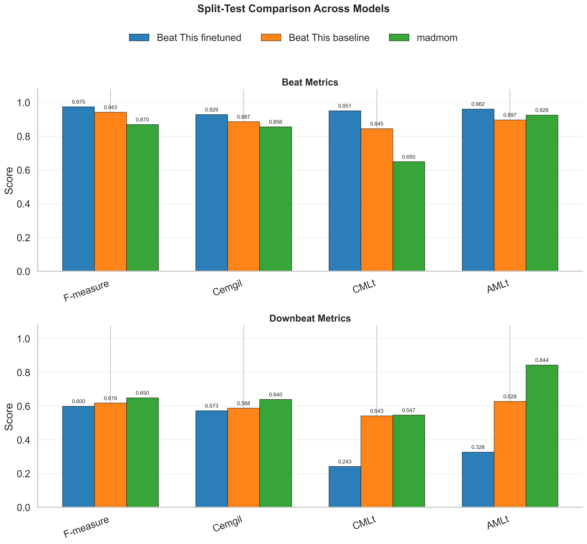

# Learning the Groove: Fine-Tuning Beat Tracking on the Jazz Trio Dataset

Improving automatic beat and downbeat tracking for jazz music.

Most state-of-the-art beat trackers are trained on pop, rock, and electronic music, where the pulse is steady and the timing is quantized. Jazz is harder: swing feel, expressive rubato, brushed drums, walking bass, and frequent tempo modulation all push these models out of distribution. This project measures how badly existing models break on jazz, and then asks whether we can fix it by training on jazz data directly.

## Aim

1. **Benchmark** the existing [Beat This!](https://github.com/CPJKU/beat_this) beat tracking model on the [Jazz Trio Database]
2. **Benchmark** the existing [madmom](https://github.com/CPJKU/madmom) beat tracking model on the [Jazz Trio Database](https://zenodo.org/records/13828030) to establish a baseline for how well a general-purpose tracker handles jazz.
3. **Retrain / fine-tune** the model on the Jazz Trio Database.
4. **Re-evaluate** the retrained model against the same baseline to quantify the improvement.

## Split-test comparison



## Dataset

The **Jazz Trio Database** (Cheston et al., 2024) is a corpus of jazz piano-trio recordings (piano, bass, drums) with frame-level annotations for beats, downbeats, and per-instrument onsets.

### Version 02 (Expanded Local Corpus)
This project utilizes the `jazz-trio-database-v02`, which contains **1294 jazz trio performances**. It spans recordings from the 1950s–2010s, providing meaningful coverage of jazz performance practice — swing eighths, tempo drift, soloist push/pull against the rhythm section, and recording-era timbral differences.

Each performance directory within the database contains:
- `beats.csv`: Human-verified beat and downbeat annotations.
- `piano_onsets.csv`, `bass_onsets.csv`, `drums_onsets.csv`: Onset times for each instrument.
- `piano_midi.mid`: MIDI representation of the piano performance.
- `metadata.json`: Track details including artist, album, year, and estimated tempo.

- Zenodo Record (v1): <https://zenodo.org/records/13828030>
- Beat This! pretrained model checkpoint: <https://cloud.cp.jku.at/index.php/s/7ik4RrBKTS273gp>

## Repository contents

- `evaluation/` — model-specific analysis notebooks and evaluation CSVs.
  - `graphs-beatthis.ipynb`: Visualization and metric analysis for Beat This!.
  - `graphs-madmom.ipynb`: Visualization and metric analysis for madmom.
  - `inference_test.ipynb`: Interactive sandbox for testing model inference.
  - `csvs/`: Raw evaluation metrics in CSV format.
- `scripts/` — support scripts for evaluation and inference.
  - `run_beat_this.py`: Wrapper for Beat This! inference.
  - `evaluate_jtd.py`: Full dataset evaluation for Beat This!.
  - `evaluate_madmom.py`: Full dataset evaluation for madmom.
  - `build_jtd_beatthis_dataset.py`: Build Beat This!-formatted training data from JTD.
  - `finetune_beat_this_jtd.py`: Fine-tune Beat This! on the processed JTD data.
  - `support_function.py`: Plotting utilities.
- `beat_this/` — core model implementation and checkpoints.
- `jazz-trio-database-v02/` — dataset annotations.
- `test_audio/` — sample audio clips for inference testing.

## Fine-tuning Beat This! on JTD

### 1. Prerequisites

- A Python environment with the Beat This dependencies used in this repo (`torch`, `torchaudio`, `pytorch-lightning`, `mir_eval`, `pandas`, `numpy`, `soxr`, `tqdm`).
- `jazz-trio-database-v02/` for annotations.
- A directory with matching audio files named `<track_id>.<ext>` (wav/flac/mp3/ogg/m4a), either flat or nested.

### 2. Build a Beat This!-compatible training dataset

This step converts JTD `beats.csv` files into `.beats` files and computes `track.npy` log-mel spectrograms.

```bash
python scripts/build_jtd_beatthis_dataset.py \
  --jtd-root jazz-trio-database-v02 \
  --audio-root /path/to/jtd-audio \
  --out-root data/beatthis_jtd \
  --dataset-name jtd \
  --val-ratio 0.15 \
  --seed 1337
```

Output layout:

```text
data/beatthis_jtd/
  annotations/jtd/info.json
  annotations/jtd/single.split
  annotations/jtd/annotations/beats/<track_id>.beats
  audio/spectrograms/jtd/<track_id>/track.npy
```

### 3. Fine-tune from the pretrained Beat This checkpoint

```bash
python scripts/finetune_beat_this_jtd.py \
  --data-dir data/beatthis_jtd \
  --checkpoint beat_this/checkpoint/final0.ckpt \
  --output-dir checkpoints/jtd_finetune \
  --accelerator gpu \
  --devices 1 \
  --precision 16-mixed \
  --batch-size 8 \
  --num-workers 8 \
  --max-epochs 40 \
  --lr 2e-4
```

The script saves:

- best checkpoint(s): `checkpoints/jtd_finetune/jtd-ft-*.ckpt`
- last checkpoint: `checkpoints/jtd_finetune/last.ckpt`

### 4. Evaluate the fine-tuned checkpoint on JTD

```bash
python scripts/evaluate_jtd.py \
  --data-root jazz-trio-database-v02 \
  --audio-root /path/to/jtd-audio \
  --checkpoint checkpoints/jtd_finetune/last.ckpt \
  --output evaluation/csvs/beat_this_jtd_finetuned.csv \
  --device cuda
```

For direct comparison against the baseline model, run the same command with `--checkpoint beat_this/checkpoint/final0.ckpt`.

## Advisor

Brian McFee (NYU Music and Audio Research Lab).
